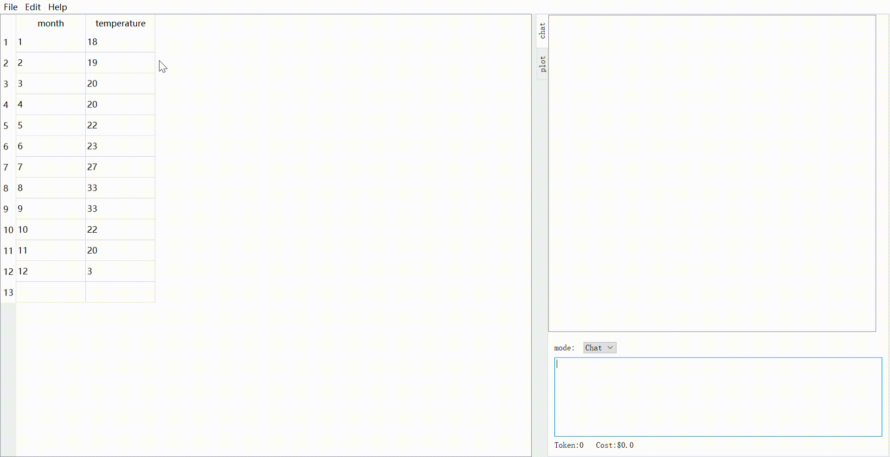

# CHAT-EXCEL
大语言模型，让excel更简单。使用对话式AI模型来辅助进行Excel数据分析与图表绘制

# Demo

# 快捷键
+ Ctrl + Q, 将问题发送给AI
+ Ctrl + A, 折叠/展开聊天窗口
+ Ctrl + Z, 撤销修改

# 原理
使用pandas来读取excel数据，将sheet表示为pandas的DataFrame对象，
使用AI生成处理DataFrame的代码，使用代码解释器执行代码并将结果反馈在GUI上，使用matplotlib来绘制图表。    
还在开发完善中，可能不稳定，某些情况下会崩溃。
解释器的部分代码借鉴自[KillianLucas/open-interpreter](https://github.com/KillianLucas/open-interpreter/tree/main)    
已知问题：
+ 某些情况下AI会给出错误的代码
+ 不支持合并了单元格的excel
+ excel的表头必须位于第一行